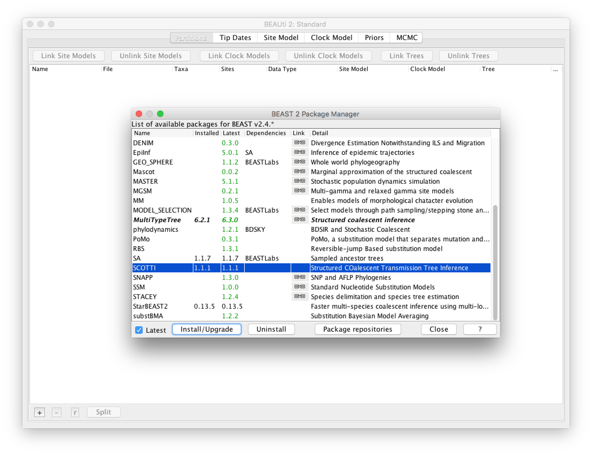
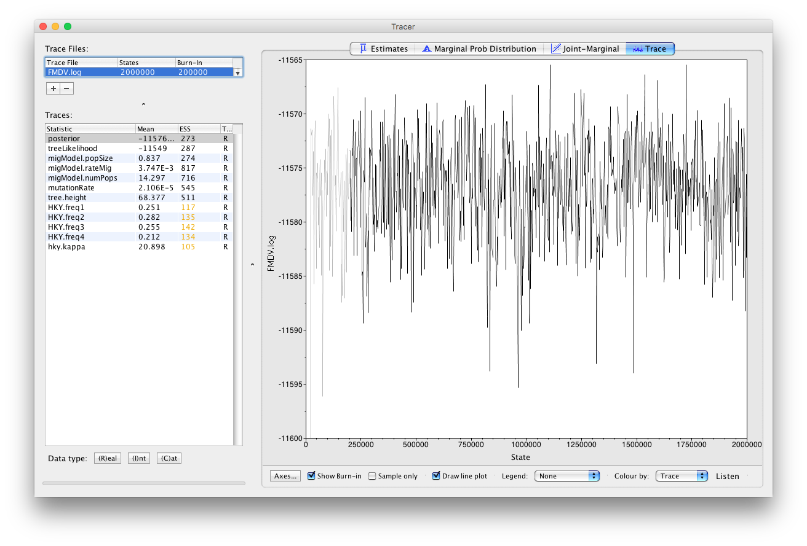
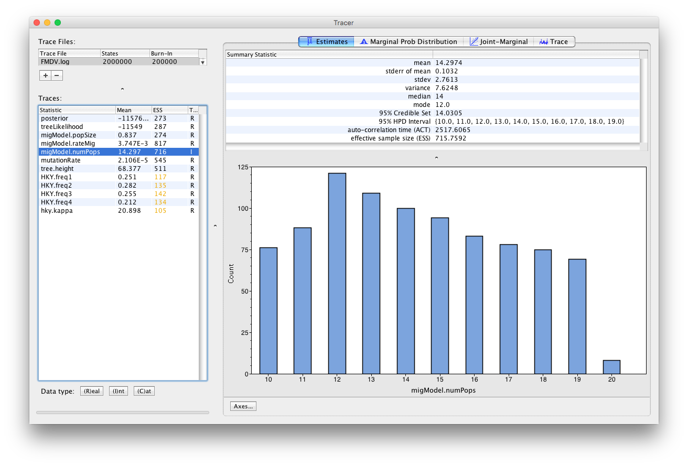
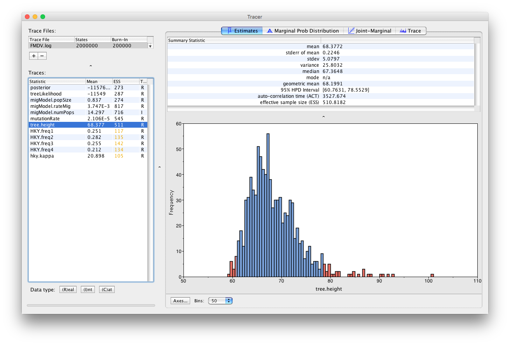
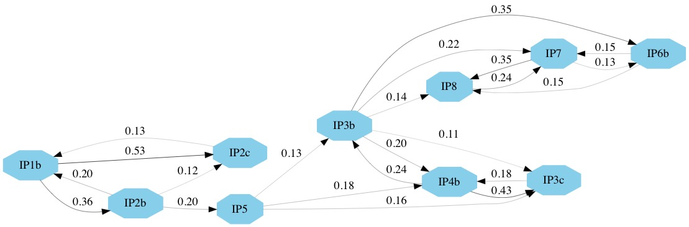

# Background

When applying phylodynamic models to pathogen genetic sequences collected during an outbreak, we usually make the assumption that the inferred genealogy approximates the true transmission tree. In most cases the structure of the true transmission tree will be similar to the inferred genealogy and inferences about epidemiological parameters (e.g. the ) are valid. However, due to complicating factors, such as within-host diversity and evolution, non-sampled patients and transmission bottlenecks, it is difficult to reconstruct transmission chains or draw conclusions about the transmission dynamics between infected patients. In particular, there may be discrepancies between the epidemiological and phylogenetic relatedness of hosts and infection times are often biased.

SCOTTI (Structured COalescent Transmission Tree Inference)  is a BEAST2 package that was developed to provide more accurate reconstructions of transmission trees.
The underlying model is a structured coalescent model, where each host is modeled as a population and migrations between populations represent new infections. 
New sequencing technologies and protocols are making it easier to sample the within-host diversity of an outbreak and SCOTTI can take advantage of multiple sequences from each host to better resolve transmission events.
Furthermore, SCOTTI can model non-sampled hosts by dynamically increasing or decreasing the number of populations (hosts). (In other structured models available in BEAST2 the number of populations remain constant and each population needs to be represented by at least one sampled sequence).
In addition to genetic sequences, SCOTTI also uses epidemiological data about host exposure times, only allowing hosts to transmit the disease during periods when they are infectious.
Thus, SCOTTI is able to model within-host diversity as well as non-sampled hosts and multiply infected hosts. However, it is currently not able to model transmission bottlenecks.

To make the inference tractable SCOTTI uses the same techniques as BASTA , which is a computationally efficient approximation to the structured coalescent. 
In addition, a number of simplifying assumptions are made. 
It is assumed that all hosts have the same infection rate and that it stays constant over the course of infection. It is also assumed that infection is equally likely between every pair of hosts.
Finally, it is assumed that all hosts have the same effective population size, . Thus, all hosts have the same within-host genetic diversity and thus all hosts have equal and constant within-host dynamics.

----


# Programs used in this Exercise 

### BEAST2 - Bayesian Evolutionary Analysis Sampling Trees 2

BEAST2 ([http://www.beast2.org](http://www.beast2.org)) is a free software package for Bayesian evolutionary analysis of molecular sequences using MCMC and strictly oriented toward inference using rooted, time-measured phylogenetic trees. This tutorial is written for BEAST v{{ page.beastversion }} . 


### BEAUti2 - Bayesian Evolutionary Analysis Utility

BEAUti2 is a graphical user interface tool for generating BEAST2 XML configuration files.

Both BEAST2 and BEAUti2 are Java programs, which means that the exact same code runs on all platforms. For us it simply means that the interface will be the same on all platforms. The screenshots used in this tutorial are taken on a Mac OS X computer; however, both programs will have the same layout and functionality on both Windows and Linux. BEAUti2 is provided as a part of the BEAST2 package so you do not need to install it separately.

### TreeAnnotator

TreeAnnotator is used to summarise the posterior sample of trees to produce a maximum clade credibility tree. It can also be used to summarise and visualise the posterior estimates of other tree parameters (e.g. node height).

TreeAnnotator is provided as a part of the BEAST2 package so you do not need to install it separately.


### Tracer

Tracer ([http://tree.bio.ed.ac.uk/software/tracer](http://tree.bio.ed.ac.uk/software/tracer)) is used to summarise the posterior estimates of the various parameters sampled by the Markov Chain. This program can be used for visual inspection and to assess convergence. It helps to quickly view median estimates and 95% highest posterior density intervals of the parameters, and calculates the effective sample sizes (ESS) of parameters. It can also be used to investigate potential parameter correlations. We will be using Tracer v{{ page.tracerversion }}.


### FigTree

FigTree ([http://tree.bio.ed.ac.uk/software/figtree](http://tree.bio.ed.ac.uk/software/figtree)) is a program for viewing trees and producing publication-quality figures. It can interpret the node-annotations created on the summary trees by TreeAnnotator, allowing the user to display node-based statistics (e.g. posterior probabilities). We will be using FigTree v{{ page.figtreeversion }}.


### Python

Python ([https://www.python.org](https://www.python.org)) is an interpreted programming language that is often used to write scripts for processing text files. We will use two Python scripts during the tutorial. Both scripts should work with Python 2.7.x and Python 3.x. There is also a third, optional, script that makes use of the `graph-tool` package to produce a better looking figure.

Python should already be installed on most Mac OS X or Linux systems.


----

# Practical: SCOTTI tutorial

In this tutorial we analyse an outbreak of Foot and Mouth Disease Virus (FMDV) that occurred in the South of England in 2007. FMDV is a highly infectious disease that affects cloven-hoofed animals (such as cattle, sheep, pigs, deer etc.) and can be easily spread between farms through contact with contaminated vehicles or animal feed. 
The usual response to FMDV is to cull all exposed livestock and quarantine surrounding farms, thus the effects of the disease can be devastating to the farming sector (the 2001 outbreak in the United Kingdom resulted in the culling of more than 10 million cows and sheep and cost £8 billion). 
It is therefore extremely important to trace the source and spread of the disease between farms. 
Because of the high genetic variability of FMDV an appreciable amount of genetic variation will accumulate over the course of an outbreak. Thus, epidemiological and evolutionary dynamics occur on the same timescale and we are dealing with a measurably evolving population, which we can analyse in BEAST. 

When analysing an FMDV outbreak we can treat each infected farm as an infected host, with the transmission tree describing infections between farms. In fact, when discussing livestock diseases it is common to refer to infected farms as cases, instead of individual infected animals. (This analogy holds because the genetic diversity of the virus within a farm is much lower than between farms, thus each farm behaves more like a single host).


## The Data

We analyse an outbreak of Foot and Mouth Disease Virus (FMDV) that occurred in the South of England. The outbreak contained two distinct clusters, in August and September of 2007, respectively. The dataset contains 11 viral sequences from 10 farms. Four sequences were sampled during the first cluster and a further 7 during the second cluster. In addition, we also have the earliest and latest possible dates during which each farm was infected with the disease ([Figure 1](#fig:outbreak)). The data were first analysed in  and later reanalysed using SCOTTI in . 


<figure>
  <a id="fig:outbreak"></a>
  
  <figcaption>Figure 1: Exposure times of infected farms and sampling dates of the viral sequences (Figure taken from ). The orange shading estimates the time when animals showing symptoms of FMDV were present on a farm. Light blue shading indicates estimates for the incubation time of each farm. The dark blue shading is the infection date estimates in . The haplotype network of the sequenced strains is superimposed on the exposure times. The red dots indicate the dates of the sampled sequences.
</figcaption>
</figure>
<br>


## Creating the input files using the included Python script

Unlike most BEAST2 packages, SCOTTI does not have a BEAUti interface. Although a BEAUti interface makes it much easier, it is not the only way to create the input XML file for a BEAST2 analysis. 
Many advanced users prefer to create the XML file in a text editor as this provides them with greater flexibility and oversight. Even if you use BEAUti to create your configuration files it is always a good idea to open the XML file in a text editor and check that everything is where it should be.
At first glance a BEAST2 XML file may seem bewildering, but the file has a rigid structure and after a while you will be able to interpret the different elements of the configuration file.
Being able to read and understand a configuration file gives you a much better understanding of how the different parts of an analysis fit together.
In addition, it gives you access to models (such as SCOTTI) that do not have BEAUti interfaces.
Once you are familiar with the structure of BEAST2 XML files and you know the different inputs of the models you want to use you will find that it is often faster to directly edit an XML file than to create it in BEAUti. 

In this tutorial we we will start at the shallow end of the pool and use a Python script, `SCOTTI_generate_xml.py`, to create the XML configuration file. It is included with the SCOTTI package and is also stored in the `scripts/` directory of this tutorial. 


### Installing the SCOTTI package

Before we can use SCOTTI we have to install the package somewhere where BEAST2 can find it. Although we won't use BEAUti to create the input configuration file, we still have to use BEAUti to install the package. We will be using SCOTTI version {{ page.scottiversion }} or above for this tutorial.

> Open **BEAUti** and open the **BEAST2 Package Manager** by navigating to **File > Manage Packages**.
>
> Install **SCOTTI** by selecting it and clicking the **Install/Upgrade** button ([Figure 2](#fig:packagemanager))
> 

<figure>
  <a id="fig:packagemanager"></a>
  
  <figcaption>Figure 2: Installing the SCOTTI package.</figcaption>
</figure>
<br>

### Running the Python script

> Open a terminal if you are using Mac OS X or Linux, or a Command Prompt if you are using Windows. 
> 
> Navigate to the directory where the `SCOTTI_generate_xml.py` script is stored.
>
> Type `python SCOTTI_generate_xml.py --help`
>

This will display help for the different input arguments of the script:

```bash

usage: SCOTTI_generate_xml.py [-h] [--fasta FASTA] [--output OUTPUT]
                              [--overwrite] [--dates DATES] [--hosts HOSTS]
                              [--hostTimes HOSTTIMES] [--maxHosts MAXHOSTS]
                              [--unlimLife] [--penalizeMigration]
                              [--numIter NUMITER]
                              [--mutationModel MUTATIONMODEL]
                              [--fixedAs FIXEDAS] [--fixedCs FIXEDCS]
                              [--fixedGs FIXEDGS] [--fixedTs FIXEDTS]
                              [--tracelog TRACELOG] [--screenlog SCREENLOG]
                              [--treelog TREELOG]

optional arguments:
  -h, --help            show this help message and exit
  --fasta FASTA, -f FASTA
                        Input fasta alignment. If not specified, looks in th
                        working directory for SCOTTI_aligment.fas
  --output OUTPUT, -o OUTPUT
                        output file that will contain the newly created SCOTTI
                        xml to be run with BEAST2.
  --overwrite, -ov      Overwrite output files.
  --dates DATES, -d DATES
                        Input csv file with sampling dates associated to each
                        sample name (same name as fasta file). If not
                        specified, looks for SCOTTI_dates.csv
  --hosts HOSTS, -ho HOSTS
                        Input csv file with sampling hosts associated to each
                        sample name (same name as fasta file). If not
                        specified, looks for SCOTTI_hosts.csv
  --hostTimes HOSTTIMES, -ht HOSTTIMES
                        Input csv file with the earliest times in which hosts
                        are infectable, and latest time when hosts are
                        infective. Use same host names as those used for the
                        sampling hosts file. If not specified, looks for
                        SCOTTI_hostTimes.csv

  ...
  ...
  ...

  --treelog TREELOG, -tl TREELOG
                        Logging frequency in the tree file.
                        Default=numIter/1000.

```

We see that we have to provide the script with four input files:

- A fasta file, containing the genetic sequences.
- A dates file, containing the sampling dates for each sequence.
- A hosts file, containing a mapping from each sequence to the host it was sampled from.
- A hostTimes file, containing the earliest and latest dates when hosts are infectious. Thus, these dates correspond to the introduction and removal of hosts to the outbreak (for instance in a hospital setting these dates will correspond to a patient's admission and release dates).

The dates, hosts and hostTimes files need to be csv-files (comma-separated values). All dates have to be provided in numbers. All four input files for the FMDV outbreak are provided in the `data/` directory of this tutorial. 

The sequence file:

```

>IP3c-46
-----------------GGTCTCACCCCTAGTAAGCCAACGACAGTCCCTGCGTTGCACTCCACA...
>IP5-51
-----------------GGTCTCACCCCTAGTAAGCCAACGACAGTCCCTGCGTTGCACTCCACA...
>IP8-62
-----------------GGTCTCACCCCTAGTAAGCCAACGACAGTCCCTGCGTTGCACTCCACA...

... 

>IP1b-4
-----------------GGTCTCACCCCTAGTAAGCCAACGACAGTCCCTGCGTTGCACTCCACA...

```

The dates file:

```

IP3c-46, 46.0
IP5-51, 51.0
IP8-62, 62.0

...

IP6b-54, 54.0

```

The hosts file:

```

IP1b-3, IP1b
IP1b-4, IP1b
IP2b-6, IP2b

...

IP8-62, IP8

```

The hostTimes file:

```

IP1b, -26.0, 7.0
IP2b, -16.0, 9.0
IP2c, -9.0, 10.0

...

IP8, 43.0, 63.0

```

Note that the script assumes that times are specified forward-in-time, thus the largest times are the ones closest to the present. In this analysis we specify time in days from the start of the outbreak (day 0). Thus, in the hostTimes file, where times are negative, that indicates that we believe those farms could have been infected weeks before the outbreak was first detected. 

> Type in:
> 
> `python SCOTTI_generate_xml.py --fasta ../data/FMDV.fasta  --dates ../data/FMDV_dates.xml --hosts ../data/FMDV_hosts.csv --hostTimes ../data/FMDV_hostTimes.csv --output FMDV --maxHosts 20 --numIter 2000000 --tracelog 2000 --treelog 20000 --screenlog 20000`
> 

This will create the input XML file for the BEAST2 analysis. You may have to change the paths to the input files before the command will work (the `--fasta`, `--dates`, `--hosts` and `--hostTimes` arguments). We also specified the following additional optional arguments:

- `--output`: The name of the output XML file and the `.log` and `.tree` files that will be produced by BEAST2.
- `--maxHosts`: The maximum number of hosts in the outbreak, including observed and unobserved hosts. Since we have data from 10 farms and no cases were found in any other farms it is unlikely that more than 20 farms were infected. We can also make the analysis run faster by restricting the maximum number of hosts to a smaller number.
- `--numIter`: We restrict the length of the chain to 2'000'000 states.
- `--traceLog`, `--treelog`, `--screenlog`: The frequency at which states are saved in the log file and tree files or output to the screen. By default the Python script will scale these frequencies to log 10'000 states and 1'000 trees. Since our chain only includes 2'000'000 states this results in states being sampled too frequently which in turn results in high auto-correlation between sampled states and low ESS values.


> **Topic for discussion:** Read the help for the `--unlimLife` and `--penalizeMigration` input arguments to the Python script. Can you figure out what these arguments do? How do you think setting these arguments to true will affect the results?
>


## Running the analysis

We should now be ready to run the analysis in BEAST2. 

> Open **BEAST2** and choose `FMDV.xml` as the BEAST XML file. If BEAGLE is installed check the box to use it. Then click **Run** ([Figure 3](#fig:beastmcmc)). 
> 

<figure>
  <a id="fig:beastmcmc"></a>
  
  <figcaption>Figure 3: Running the analysis in BEAST2.</figcaption>
</figure>
<br>

If you use the seed 2007 you should be able to duplicate the results in the next section. The analysis should take between 10 and 20 minutes to run. While the analysis is running open the XML file in a text editor and see if you can identify the different model components.


> **Topic for discussion:** The Python script we used to create the configuration file only allows us to choose between a Jukes-Cantor or HKY site model, without any rate heterogeneity or invariant sites. In addition, it only allows one locus/partition in the alignment and uses a strict clock. It also doesn't give us any options for setting different priors or operators.
>
> Do you think there are situations where you would want to use a different site or clock model? What about the model priors? In particular, which priors would you want to change?
>
> Suppose you wanted to perform a SCOTTI analysis using a GTR substitution with a lognormal relaxed clock. How would you go about it?
>


## Analysing the output in Tracer and FigTree

> Open **Tracer** and load the file `FMDV.log`. Click on the **Trace** tab and examine the parameter traces.
> 

The Python script only logs a few key parameters ([Figure 4](#fig:tracer)). Note that not all parameters have perfect mixing. For a real analysis we would run the chain much longer and aim to collect at least 10'000 samples (this log file contains only 1'000 samples). 

<figure>
  <a id="fig:tracer"></a>
  
  <figcaption>Figure 4: The results of the analysis in Tracer.</figcaption>
</figure>
<br>

> Click on **Estimates** and select **migmodel.numPops**.
>
> Since this is an integer parameter click on **(I)nt** at the bottom of the panel ([Figure 5](#fig:numPops)).
>

<figure>
  <a id="fig:numPops"></a>
  
  <figcaption>Figure 5: Estimates for the number of infected farms.</figcaption>
</figure>
<br>


This parameter estimates the number of hosts in the outbreak. It is bounded below by 10 (the number of sampled farms) and above by 20, which was our input upper bound. We see that there appears to be significant support for almost twice as many farms to have been infected as farms where diseased animals were found. The parameter **migModel.popSize** logs the effective population size of the hosts, which is directly proportional to the genetic diversity of the virus within each farm. We see that the effective population size is quite low, which is probably due to the relatively short period of the outbreak. The equal infection rate between farms is logged by **migModel.rateMig** and the clock rate by **mutationRate**. If the clock rate seems low for a virus, keep in mind that we measure time in days. Thus, the units for substitutions are in substitutions/site/day instead of the usual substitutions/site/year.

> Select **tree.height** ([Figure 6](#fig:tmrca))
>

<figure>
  <a id="fig:tmrca"></a>
  
  <figcaption>Figure 6: Estimates for the TMRCA.</figcaption>
</figure>
<br>

This parameter is the TMRCA of the sequences included in the transmission tree. The median estimate is 67.36 days. Since the most recent sample was taken on day 62 of the outbreak (IP8-62), this indicates that it is unlikely that the outbreak started more than a week before it was discovered and confirmed, which is an encouraging sign for the surveillance of foot and mouth disease in the United Kingdom. 


> Open **TreeAnnotator** and set the **Burnin percentage** to 10. Leave the other options unchanged.
>
> Load the file `FMDV.trees` and change the **Output file** to `FMDV.MCC.tree` ([Figure 7](#fig:treeannotator)). 
> 

<figure>
  <a id="fig:treeannotator"></a>
  
  <figcaption>Figure 7: Creating the MCC tree.</figcaption>
</figure>
<br>

> Open **FigTree** and load `FMDV.MCC.tree`.
> 
> Click on the arrow to the right **Appearance** and in the **Colour by** dropdown box select **host**. Check **Gradient** and increase the **Line Weight** to **5**. 
>
> Increase the **Font Size** under **Tip Labels**. Check **Node Labels** and select **host.prob** from the dropdown box and increase the **Font size**.
> 
> Check **Legend** and select **host** as **Attribute**.
> 

<figure>
  <a id="fig:figtree"></a>
  
  <figcaption>Figure 8: The MCC tree in FigTree.</figcaption>
</figure>
<br>

We see that in the MCC tree ([Figure 8](#fig:figtree)) one node is an unsampled node (between the two outbreak clusters). Thus, there is evidence of a non-sampled farm between IP2b and IP5. We further see that while the posterior probabilities for some internal nodes are quite high, it is below 0.5 for several nodes. Note that since SCOTTI does not model the transmission bottleneck it cannot estimate the time of infection. Thus, it is better to display the tree with a gradient between hosts than with a discrete colouring. 

> Under **Node Labels** change the **Display** attribute first to **host.set** and then to **host.set.prob** ([Figure 9](#fig:hostsets))
>

<figure>
  <a id="fig:hostsets"></a>
  
  <figcaption>Figure 9: The sets of probable hosts in FigTree.</figcaption>
</figure>
<br>

This displays respectively the set of hosts with a non-zero posterior probability and the posterior probability for those nodes. We see that although many internal nodes have a large set of possible hosts, only two or three hosts have reasonably large posterior probabilities for each internal node.


## Constructing the transmission network

The MCC tree is a summary of the set of posterior trees. Although it is useful it is not necessarily the best way to look at the transmission tree. We will use a Python script to construct a transmission network that shows the probabilities of transmissions between every pair of farms. We will use the script `Make_transmission_tree_alternative.py`, which does not require any external packages. However, if you have installed the `graph-tool` package you may use the script `Make_transmission_tree.py`, which will produce better looking figures.


> Open a terminal if you are using Mac OS X or Linux, or a Command Prompt if you are using Windows. 
> 
> Navigate to the directory where the `Make_transmission_tree_alternative.py` script is stored.
>
> Type in `python Make_transmission_tree_alternative.py --input ../precooked_runs/FMDV.trees --outputF FMDV_transmission --burnin 10`
> 

This will create 3 files:

- `FMDV_transmission_direct_transmissions.jpg`
- `FMDV_transmission_indirect_transmissions`
- `FMDV_transmission_network.txt`

<figure>
  <a id="fig:hostsets"></a>
  
  <figcaption>Figure 9: The direct transmission network.</figcaption>
</figure>
<br>

The network of direct transmissions is shown in [Figure 10](fig:transmissiontree1). By default only transmissions with a probability bigger than 10% are shown. We can identify a few key points from the transmission network. First, the chance of a direct transmission between the first and the second cluster (betwen IP2b and IP5) is quite low, thus there is a large chance that there are some non-sampled farms. There also appears to be evidence for non-sampled farm(s) between IP5 and the other farms in the second cluster. Secondly, it appears likely that IP3b was responsible either directly or indirectly, for the infection of IP6b, IP7 and IP8. In several parts of the network there are a number of possible transmission routes, however in most cases one route is more likely than others. For example, it is more likely that IP1b infected IP2c and that IP7 infected IP8 than vice-versa. It also appears likely that IP1b was the first infected farm. This information is also summarised in the text file `FMDV_transmission_network.txt`.

Although this information is very useful for informing us about the transmission dynamics of an outbreak we should be careful not to over-interpret the results. There is still a lot of uncertainty in the transmission network, thus a link in the network does not necessarily indicate a definite transmission pair. Moreover, the presence of non-sampled hosts make it difficult to unambiguously identify transmission pairs or superspreaders.


----

# Useful Links

- SCOTTI website with documentation: [https://bitbucket.org/nicofmay/scotti/](https://bitbucket.org/nicofmay/scotti/)
- [Bayesian Evolutionary Analysis with BEAST 2](http://www.beast2.org/book.html) 
- BEAST 2 website and documentation: [http://www.beast2.org/](http://www.beast2.org/)
- Join the BEAST user discussion: [http://groups.google.com/group/beast-users](http://groups.google.com/group/beast-users) 

----

# Relevant References




